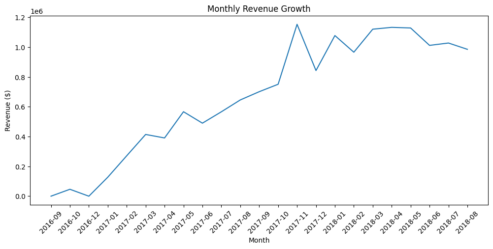
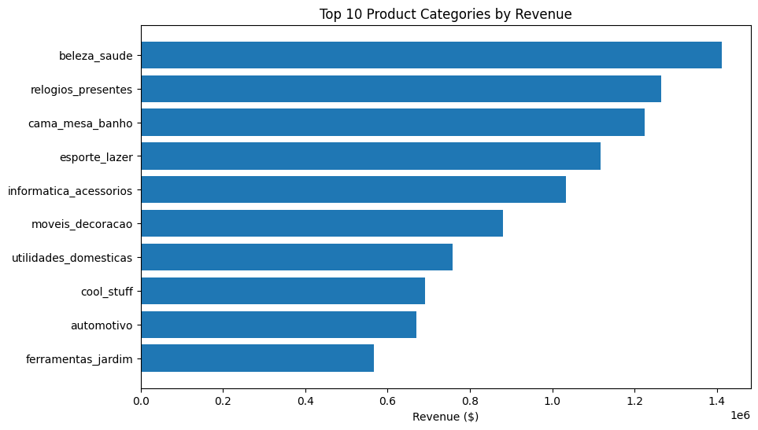
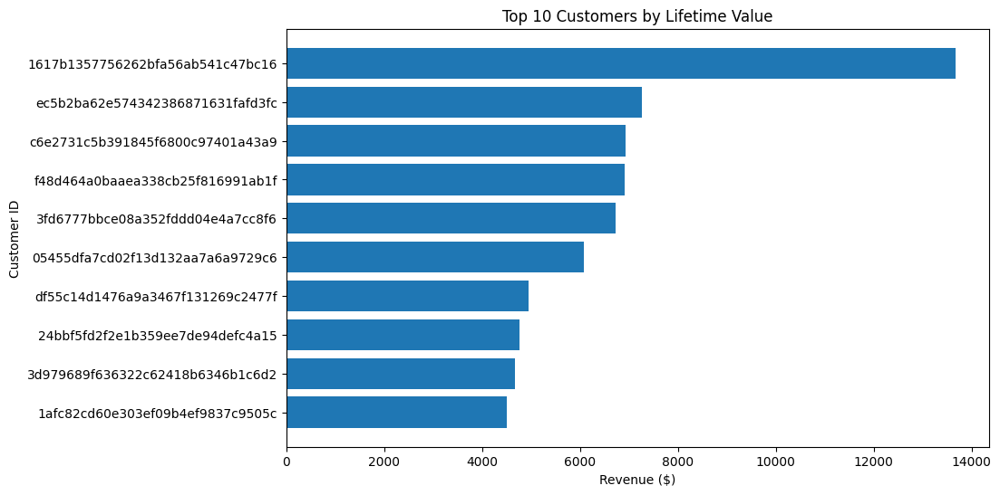
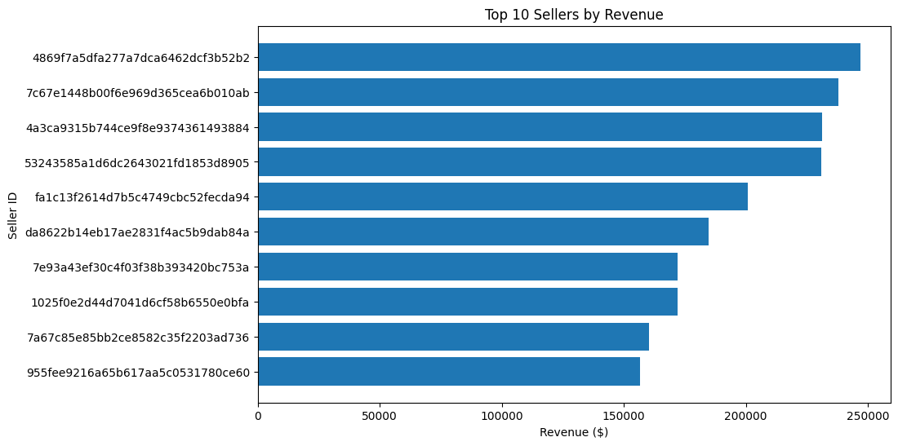

# 📊 E-Commerce Customer & Sales Analytics

An end-to-end data analytics project using **PostgreSQL, Python, and Power BI** to analyze e-commerce sales performance, customer behaviour, product trends, and operational metrics.

The project demonstrates a complete analytics workflow:

**Data → Database Design → SQL Analysis → Python EDA → Visualisation → Business Insights**

---

# 🧭 Project Overview

This project analyzes a marketplace-style e-commerce dataset containing customer orders, products, sellers, payments, and reviews.

The goal is to uncover:

- Revenue growth trends
- Top-performing product categories
- Customer purchasing behaviour
- High-value customer segments
- Seller performance
- Delivery performance
- Customer satisfaction patterns

The analysis provides business recommendations to improve customer retention, increase revenue, and optimise marketplace operations.

---

# 🛠️ Tech Stack

## Database
- PostgreSQL
- pgAdmin

## Data Analysis
- Python
- pandas
- NumPy

## Visualisation
- Matplotlib

## Development Tools
- Jupyter Notebook
- Git/GitHub

---

# 🗂️ Project Structure

```
customer-sales-analytics/

│
├── sql/
│   ├── schema.sql
│   ├── cleaning.sql
│   └── business_analysis.sql
│
├── notebooks/
│   └── ecommerce_analysis.ipynb
│
├── src/
│   └── database.py
│
├── visuals/
│   ├── revenue_growth.png
│   ├── top_categories_revenue.png
│   ├── customer_revenue_deciles.png
│   └── top_sellers_by_revenue.png
│
├── insights.md
├── README.md
└── requirements.txt
```

---

# 🗄️ Database Design

The dataset was transformed into a relational PostgreSQL database.

Main tables:

### Fact Tables
- `fact_sales`
- `order_items`
- `payments`
- `reviews`

### Dimension Tables
- `customers`
- `products`
- `sellers`
- `geolocation`

The database structure supports efficient analysis through:

- Primary keys
- Foreign keys
- Data cleaning views
- Aggregated analytical tables

---

# 📈 Analysis Performed

## Revenue Analysis

Analysed:

- Total revenue
- Monthly revenue trends
- Average order value
- Order volume growth

Key metric:

```
Total Revenue: $15.4M
Total Orders: 96,478
Average Order Value: $159.83
```

---

## Product & Category Analysis

Analysed:

- Top-performing categories
- Product revenue contribution
- Category trends over time

Top revenue categories include:

- Beauty & Health
- Watches & Gifts
- Bed, Bath & Table
- Sports & Leisure
- Computers & Accessories

---

## Customer Analytics

Performed customer segmentation using:

- Lifetime value analysis
- Revenue ranking
- RFM-style analysis
- Revenue deciles

Key findings:

- Revenue is concentrated among high-value customers
- Repeat purchasing behaviour is limited
- Retention represents a major growth opportunity

---

## Seller Performance

Analysed:

- Seller revenue contribution
- Items sold
- Marketplace performance distribution

Identified top sellers contributing significant marketplace revenue.

---

## Operational Analysis

Evaluated:

- Delivery performance
- Average delivery time
- Customer review behaviour

Key metric:

```
Average delivery time: ~12 days
```

---

# 📊 Visualisations

## Revenue Growth


Shows marketplace expansion over time.

---

## Top Categories by Revenue


Highlights the categories driving the largest revenue contribution.

---

## Customer Revenue Distribution


Shows revenue concentration across customer segments.
---

## Seller Performance


Compares revenue contribution from leading sellers.

---

# 💡 Key Business Insights

## 1. Strong Revenue Growth

The marketplace experienced significant expansion from 2016–2018, reaching over **$1M monthly revenue** during peak periods.

---

## 2. Revenue Concentration

The highest-value customer segment contributes a disproportionate share of revenue.

Business opportunity:

- Improve VIP retention
- Develop targeted customer engagement

---

## 3. Limited Customer Retention

Most customers make only one purchase.

Recommendations:

- Loyalty programs
- Personalised recommendations
- Customer reactivation campaigns

---

## 4. Category Dependency

A small number of categories generate the majority of revenue.

Recommendations:

- Expand high-performing categories
- Optimise marketing investment

---

## 5. Operational Improvement Opportunities

Delivery performance and seller quality represent opportunities to improve customer experience.

---

# 🚀 Business Recommendations

Based on the analysis:

### Improve Customer Retention
- Introduce loyalty programs
- Create personalised campaigns
- Target high-value customers

### Increase Basket Size
- Product bundling
- Cross-selling recommendations
- Multi-item discounts

### Optimise Marketplace Performance
- Support high-performing sellers
- Improve delivery processes
- Monitor customer satisfaction

---

# ▶️ How to Run

## 1. Clone repository

```bash
git clone <repository-url>
cd customer-sales-analytics
```

---

## 2. Install dependencies

Create a virtual environment (optional):

```bash
python -m venv .venv
```

Activate it:

Windows:

```bash
.venv\Scripts\activate
```

Install required packages:

```bash
pip install -r requirements.txt
```

---

## 3. Setup PostgreSQL Database

Create a PostgreSQL database:

```sql
CREATE DATABASE ecommerce_analytics;
```

Run the SQL setup scripts in order:

### Create tables

```bash
psql -U <username> -d ecommerce_analytics -f sql/schema.sql
```

### Load and clean data

```bash
psql -U <username> -d ecommerce_analytics -f sql/cleaning.sql
```

### Run business analysis queries (optional)

```bash
psql -U <username> -d ecommerce_analytics -f sql/business_analysis.sql
```

---

## 4. Configure Database Connection

Update:

```
src/database.py
```

with your PostgreSQL credentials:

```python
DB_USER = "your_username"
DB_PASSWORD = "your_password"
DB_HOST = "localhost"
DB_PORT = "5432"
DB_NAME = "ecommerce_analytics"
```

---

## 5. Run Python Analysis Notebook

Launch Jupyter:

```bash
jupyter notebook
```

Open:

```
notebooks/ecommerce_analysis.ipynb
```

Run the notebook cells to reproduce:

- Exploratory data analysis
- Customer analysis
- Product analysis
- Seller analysis
- Business visualisations

---

# 📌 Future Improvements

Possible extensions:

- Build interactive Power BI dashboard
- Add customer churn prediction model
- Implement automated ETL pipeline
- Create machine learning recommendations
- Add geographic sales analysis

---

# 🧾 Final Summary

This project demonstrates an end-to-end analytics workflow combining **SQL database engineering, Python data analysis, and business intelligence**.

The analysis identifies key growth drivers, customer segments, category performance, and operational opportunities to support data-driven decision making.